# 🗺️ Learning Roadmap

> ⚠️ **Disclaimer:** This roadmap is dynamic and approximate. I actively adjust, reorder, and refine this path based on practical needs, project requirements, and deep-dive insights during my learning journey. It is a flexible guide, not a rigid rulebook.

## 🧭 Roadmap Layers & Dependencies

Below is a visual graph showing how these technologies interconnect. I build my knowledge layer by layer, moving from core language features to databases, asynchronous architecture, and DevOps.

```mermaid
graph LR

    A["Python OOP"]
    --> B["Typing & Code Quality"]
    --> C["Git"]
    --> D["Pydantic v2 & Settings"]
    --> E["Pytest"]
    --> F["Loguru"]
    --> G["HTTPX"]
    --> H["Asyncio"]
    --> I["FastAPI"]
    --> J["PostgreSQL"]
    --> K["SQLAlchemy 2.0"]
    --> L["Alembic"]
    --> M["Docker & Compose"]
    --> N["Redis"]
    --> O["Celery"]
    --> P["RabbitMQ"]
    --> Q["CI/CD (GitHub Actions)"]
    --> R["Apache Kafka"]
    --> S["Kubernetes (K8s)"]
    --> T["Go"]
```

## 📋 The Pipeline (Checklist)

[x] Python: OOP (Completed)

[ ] Python: Typing ⏳ Current Focus

[ ] Pydantic v2 & python-dotenv (Pydantic Settings)

[ ] Loguru & HTTPX

[ ] Asyncio

[ ] FastAPI

[ ] PostgreSQL (SQL) & SQLAlchemy 2.0

[ ] Alembic

[ ] Pytest

[ ] Docker & Docker Compose

[ ] Redis

[ ] RabbitMQ & Celery

[ ] CI/CD (GitHub Actions)

[ ] Apache Kafka

[ ] Go (Golang)

[ ] Kubernetes (K8s)
