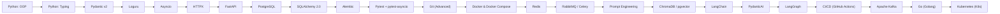

# 🗺️ Learning Roadmap

> ⚠️ **Disclaimer:** This roadmap is dynamic and approximate. I actively adjust, reorder, and refine this path based on practical needs, project requirements, and deep-dive insights during my learning journey. It is a flexible guide, not a rigid rulebook.

## 🧭 Roadmap Layers & Dependencies

Below is a visual graph showing how these technologies interconnect. I build my knowledge layer by layer, moving from core language features to databases, asynchronous architecture, and DevOps.

```mermaid
graph LR

    A["Python: OOP"]
    --> B["Python: Typing"]
    --> C["Pydantic v2"]
    --> D["Loguru"]
    --> E["Asyncio"]
    --> F["HTTPX"]
    --> G["FastAPI"]
    --> H["PostgreSQL"]
    --> I["SQLAlchemy 2.0"]
    --> J["Alembic"]
    --> K["Pytest + pytest-asyncio"]
    --> L["Git (Advanced)"]
    --> P["Docker & Docker Compose"]
    --> Q["Redis"]
    --> R["RabbitMQ / Celery"]
    --> S["Prompt Engineering"]
    --> U["ChromaDB / pgvector"]
    --> V["LangChain"]
    --> W["PydanticAI"]
    --> X["LangGraph"]
    --> Y["CI/CD (GitHub Actions)"]
    --> Z["Apache Kafka"]
    --> AA["Go (Golang)"]
    --> AB["Kubernetes (K8s)"]
```

## 📋 Roadmap 

* Python: OOP
* Python: Typing
* Pydantic v2
* Loguru
* Asyncio
* HTTPX
* FastAPI
* PostgreSQL
* SQLAlchemy 2.0 
* Alembic
* PostgreSQL (Advanced)
* Pytest + pytest-asyncio
* Git (Advanced)
* Docker & Docker Compose
* Prompt Engineering 
* Redis
* RabbitMQ \ Celery
* ChromaDB / pgvector 
* LangChain
* PydanticAI
* LangGraph 
* CI/CD (GitHub Actions)
* Apache Kafka
* Go (Golang)
* Kubernetes (K8s)
